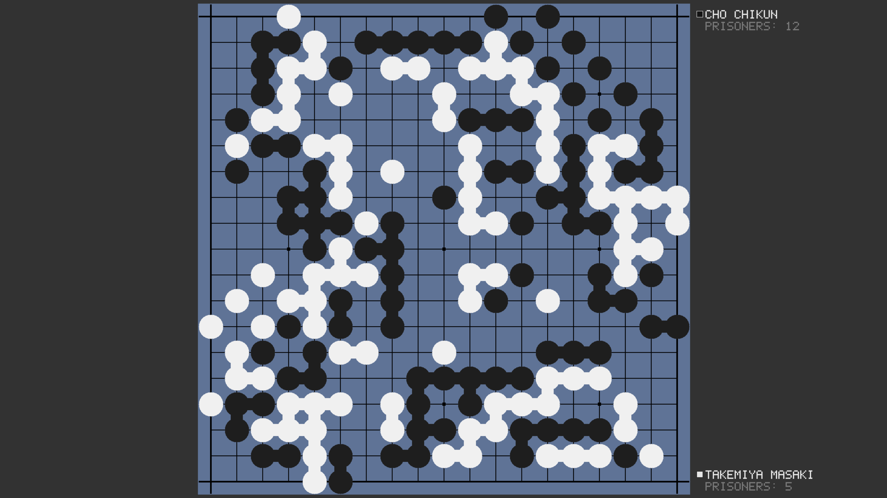

# Go Viewer

A Go game viewer for studying professional games, written in C++ with SDL2.



## Building

### Linux (Arch / Debian / Fedora)

**Arch Linux**
```bash
sudo pacman -S sdl2 cmake base-devel
cmake -B build && cmake --build build --target go_viewer
./build/go_viewer
```

**Debian / Ubuntu**
```bash
sudo apt install libsdl2-dev cmake build-essential
cmake -B build && cmake --build build --target go_viewer
./build/go_viewer
```

**Fedora**
```bash
sudo dnf install SDL2-devel cmake gcc-c++
cmake -B build && cmake --build build --target go_viewer
./build/go_viewer
```

### macOS (Homebrew)

```bash
brew install sdl2 cmake
cmake -B build && cmake --build build --target go_viewer
./build/go_viewer
```

### Windows (MSYS2 / MinGW64)

1. Install [MSYS2](https://www.msys2.org/) and open the **MSYS2 MinGW64** shell.
2. Install dependencies:
```bash
pacman -S mingw-w64-x86_64-gcc mingw-w64-x86_64-SDL2 mingw-w64-x86_64-pkg-config
```
3. Build (direct g++ invocation is more reliable than CMake on MSYS2):
```bash
export PATH="/c/msys64/mingw64/bin:/c/msys64/usr/bin:$PATH"
export TEMP="/tmp" TMP="/tmp"
g++ -std=c++17 -O2 $(pkg-config --cflags sdl2) \
    main.cpp go_rules.cpp game_state.cpp analysis_state.cpp catalog.cpp renderer.cpp \
    $(pkg-config --libs sdl2) -o go_viewer.exe
```
4. Copy `SDL2.dll` next to the executable so it can run outside the MSYS2 shell:
```bash
cp /c/msys64/mingw64/bin/SDL2.dll .
```
5. Run: `./go_viewer.exe`

## Usage

1. Place `.sgf` files in a `games/` folder next to the executable.
   You can organise them in subdirectories — the catalog browser handles them.
2. Run the executable.  It picks a random game on startup.
3. Press **ESC** at any time to toggle the in-app help overlay.

## Controls

| Key | Action |
|-----|--------|
| **Q** | Quit |
| **N** | Next game |
| **R** | Restart current game |
| **C** | Open catalog browser |
| **ESC** | Toggle help overlay |
| **Up / Down** | Faster / slower auto-playback |
| **Left / Right** | Step back / forward one move |

### Modes

| Key | Mode |
|-----|------|
| **Space / A** | Analysis mode — place and remove stones freely |
| **G** | Guess mode — predict each move; scored ±1 per guess |
| **P** | Play mode — two players on an empty board |
| **T** | Territory drill — estimate which marked territory is larger |
| **U** | Toggle chain-connection lines |

### Analysis mode
- **Left-click empty** — place a stone (alternates black/white)
- **Hold B / W** while clicking — force black or white
- **Left-click stone** — show / hide its chain's liberties
- **Right-click stone** — remove it

### Catalog browser
- **Up / Down** — navigate; **Enter** — open; **ESC** — close

## Source files

| File | Purpose |
|------|---------|
| `go_viewer.hpp` | Shared constants and types |
| `go_rules.cpp/hpp` | Go rules (capture, liberty counting, suicide check) |
| `game_state.cpp/hpp` | Game state and snapshot history |
| `analysis_state.cpp/hpp` | Free-placement analysis board |
| `catalog.cpp/hpp` | SGF file browser |
| `renderer.cpp/hpp` | All SDL2 rendering |
| `main.cpp` | App loop, input handling, drill logic |
| `CMakeLists.txt` | CMake build (Linux / macOS / MSVC) |
