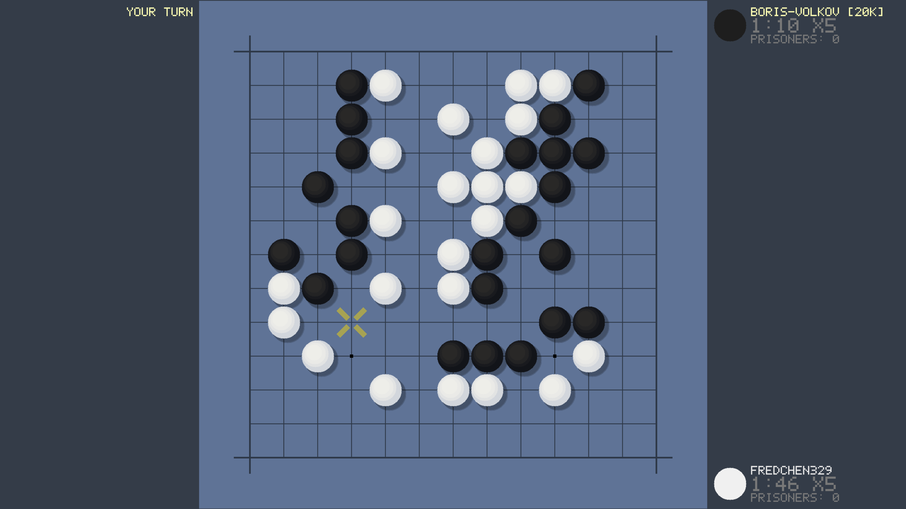
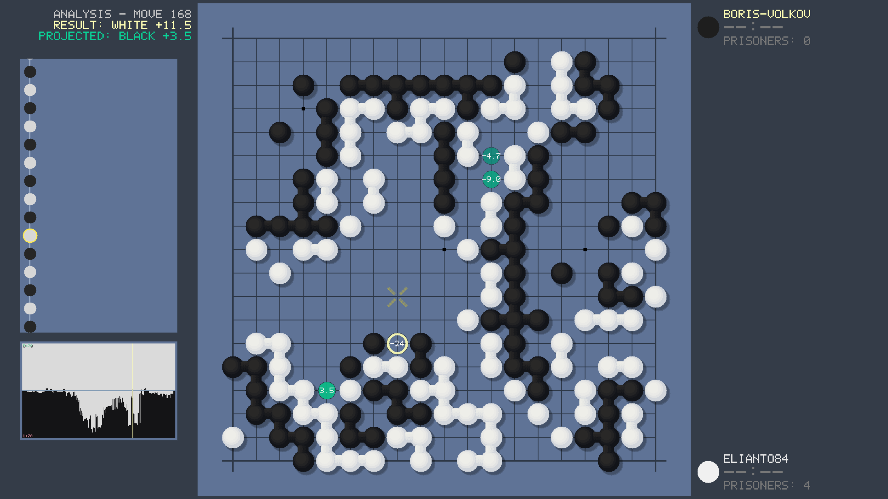
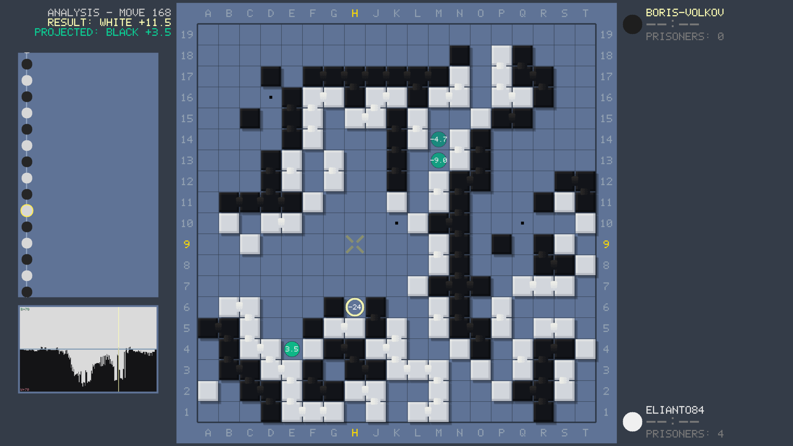
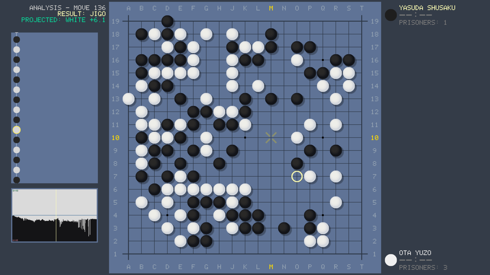
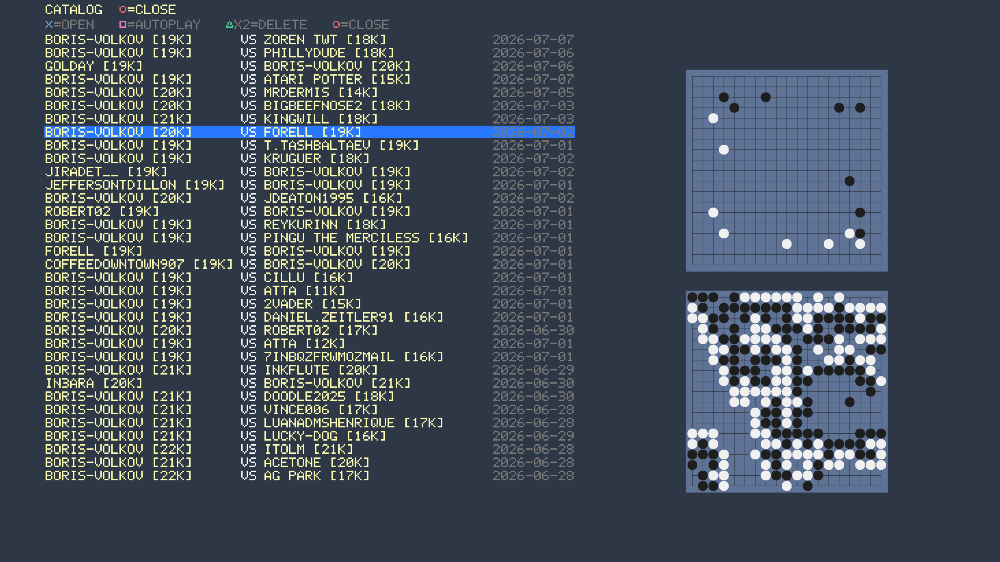

# go_station

Play, analyze, and study Go with a PlayStation controller.







## Setup

1. Build `ogs_client` — see [Building](#building) below.
2. Copy `apps/ogs_client/config.ini.example` to `apps/ogs_client/config.ini`.
3. Add your OGS login. Pick whichever applies:
   - **Most accounts** — fill in `username=` and `password=`. The client logs
     in the same way the website does; nothing else is needed.
   - **Signed up via Google / Facebook / etc., with no separate OGS
     password?** Use a JWT instead: log into
     [online-go.com](https://online-go.com) in a browser, open DevTools
     (F12) → **Application** tab → **Local Storage** → `https://online-go.com`
     → copy the value of the `ogs_user_jwt` key → paste it into `jwt=` in
     `config.ini`.
4. *(Optional)* KataGo analysis — point `katago_exe` / `katago_model` /
   `katago_config` at a local KataGo install; see the comments in
   `config.ini.example` for the exact fields and a model download link.
5. Run `ogs_client.bat` at the repo root (or `apps/ogs_client/ogs_client.exe`
   directly).

`go_viewer` — the pro-game library browser — needs no setup beyond building
it; just run `go_viewer.bat`.

## What's here

This is a small monorepo: a shared Go engine + SDL renderer (`engine/`), and
two apps built on it (`apps/`).

| Path | What it is |
|------|------------|
| `engine/` | Shared Go rules, game state, SGF catalog browser, SDL renderer |
| `apps/go_viewer/` | Standalone viewer for the pro game library in `games/` |
| `apps/ogs_client/` | Online-go.com client — live play, puzzles, local KataGo analysis |
| `games/` | Curated professional game library (SGF) |
| `my_games/` | My own OGS game history — kept for reference, not example data |
| `tools/` | Packaging and maintenance scripts |

## Building

`engine/` and `apps/go_viewer/` only need SDL2. `apps/ogs_client/` additionally
needs libcurl and libwebsockets, and a `config.ini` (see [Setup](#setup)
above).

### go_viewer — Linux (Arch / Debian / Fedora)

**Arch Linux**
```bash
sudo pacman -S sdl2 cmake base-devel
cmake -B build && cmake --build build --target go_viewer
./build/apps/go_viewer/go_viewer
```

**Debian / Ubuntu**
```bash
sudo apt install libsdl2-dev cmake build-essential
cmake -B build && cmake --build build --target go_viewer
./build/apps/go_viewer/go_viewer
```

**Fedora**
```bash
sudo dnf install SDL2-devel cmake gcc-c++
cmake -B build && cmake --build build --target go_viewer
./build/apps/go_viewer/go_viewer
```

### go_viewer — macOS (Homebrew)

```bash
brew install sdl2 cmake
cmake -B build && cmake --build build --target go_viewer
./build/apps/go_viewer/go_viewer
```

### go_viewer — Windows (MSYS2 / MinGW64, direct g++)

1. Install [MSYS2](https://www.msys2.org/) and open the **MSYS2 MinGW64** shell.
2. Install dependencies:
```bash
pacman -S mingw-w64-x86_64-gcc mingw-w64-x86_64-SDL2 mingw-w64-x86_64-pkg-config
```
3. From the repo root, build (direct g++ invocation is more reliable than CMake on MSYS2):
```bash
export PATH="/c/msys64/mingw64/bin:/c/msys64/usr/bin:$PATH"
export TEMP="/tmp" TMP="/tmp"
g++ -std=c++17 -O2 $(pkg-config --cflags sdl2) -Iengine \
    apps/go_viewer/main.cpp \
    engine/go_rules.cpp engine/game_state.cpp engine/analysis_state.cpp \
    engine/catalog.cpp engine/game_index.cpp engine/renderer.cpp \
    $(pkg-config --libs sdl2) -o go_viewer.exe
```
4. Copy `SDL2.dll` next to the executable so it can run outside the MSYS2 shell:
```bash
cp /c/msys64/mingw64/bin/SDL2.dll .
```
5. Run: `./go_viewer.exe` (from the repo root — see note below)

### Everything, via CMake (Windows / MinGW)

```powershell
cmake -B build -G "MinGW Makefiles" -DCMAKE_PREFIX_PATH=C:/msys64/mingw64
cmake --build build
```
Builds both apps in one pass. `ogs_client` additionally needs
`pacman -S mingw-w64-x86_64-curl mingw-w64-x86_64-libwebsockets`. Executables
land in `build/apps/<name>/` and are copied back next to their source
directories — `apps/go_viewer/go_viewer.exe`, `apps/ogs_client/ogs_client.exe`
— which is what `go_viewer.bat` / `ogs_client.bat` launch.

## go_viewer

### Usage

1. Place `.sgf` files in a `games/` folder at the repo root.
   You can organise them in subdirectories — the catalog browser handles them.
2. Run the executable **with your terminal's working directory set to the repo
   root** — go_viewer looks for `games/` relative to the current directory, not
   the executable's own location. It picks a random game on startup.
3. Press **ESC** at any time to toggle the in-app help overlay.

### Controls

| Key | Action |
|-----|--------|
| **Q** | Quit |
| **N** | Next game |
| **R** | Restart current game |
| **C** | Open catalog browser |
| **ESC** | Toggle help overlay |
| **Up / Down** | Faster / slower auto-playback |
| **Left / Right** | Step back / forward one move |

#### Modes

| Key | Mode |
|-----|------|
| **Space / A** | Analysis mode — place and remove stones freely |
| **G** | Guess mode — predict each move; scored ±1 per guess |
| **P** | Play mode — two players on an empty board |
| **T** | Territory drill — estimate which marked territory is larger |
| **U** | Toggle chain-connection lines |

#### Analysis mode
- **Left-click empty** — place a stone (alternates black/white)
- **Hold B / W** while clicking — force black or white
- **Left-click stone** — show / hide its chain's liberties
- **Right-click stone** — remove it

#### Catalog browser
- **Up / Down** — navigate; **Enter** — open; **ESC** — close

## ogs_client

An online-go.com client with local play and analysis against KataGo —
automatch, live play, stone-removal scoring, an OGS puzzle player, adaptive
practice opponents, batch autoplay through a game folder, and more — built on
the same engine as go_viewer above. See [Setup](#setup) above for connecting
your OGS account. This app in particular has grown around my own day-to-day
usage rather than a fixed feature set, so this README is the full extent of
its onboarding — a PlayStation controller is assumed for the on-screen
control hints, though mouse and keyboard work throughout as well.

## Source files

| File | Purpose |
|------|---------|
| `engine/go_viewer.hpp` | Shared constants and types |
| `engine/go_rules.cpp/hpp` | Go rules (capture, liberty counting, suicide check) |
| `engine/game_state.cpp/hpp` | Game state and snapshot history |
| `engine/analysis_state.cpp/hpp` | Free-placement analysis board |
| `engine/catalog.cpp/hpp` | SGF file browser |
| `engine/renderer.cpp/hpp` | All SDL2 rendering |
| `engine/CMakeLists.txt` | Builds the shared `go_engine` static library |
| `apps/go_viewer/main.cpp` | App loop, input handling, drill logic |
| `apps/go_viewer/CMakeLists.txt` | Builds the `go_viewer` executable |
| `apps/ogs_client/` | OGS networking, KataGo integration, puzzles, sound |
| `CMakeLists.txt` (repo root) | Top-level build — wires up `engine/` and both `apps/` |
